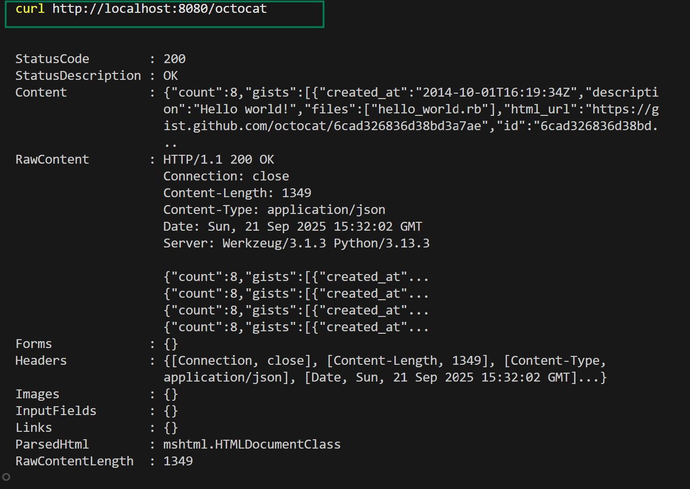
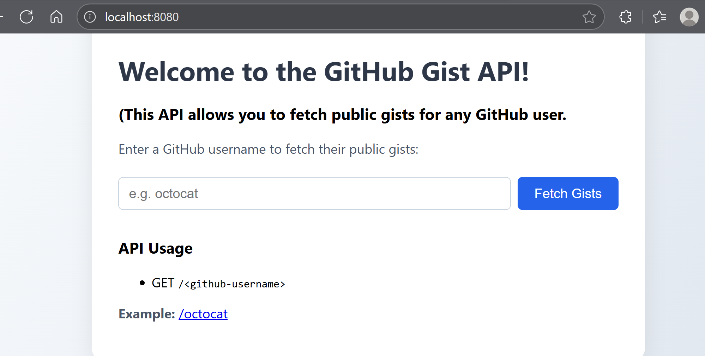
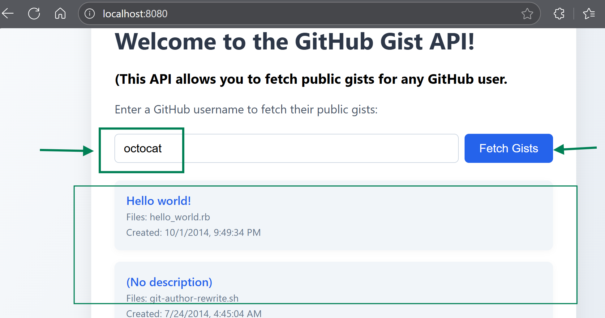
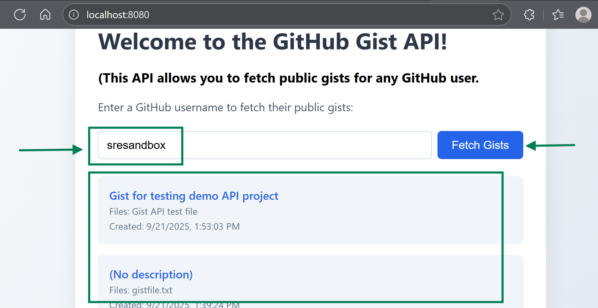

## 1. Project Objective

This project builds a simple HTTP web server API that:

- Listens for requests like:  
  `http://localhost:8080/<username>`
- Fetches the public gists of that GitHub user (using the GitHub API).
- Returns them in a clean, JSON response format.
- Is packaged in a Docker container for easy deployment.
- Includes an automated test to prove it works (using GitHub’s sample user `octocat`).
---
## GitHub Gist API
A simple Flask-based API and web interface to fetch and display public GitHub gists for any user.

---
## What is a GitHub Gist?

A Gist is a simple way to share code snippets, notes, or text on GitHub.  
Think of it like a “mini repository” that’s super lightweight.

- It can contain one or more files.
- Each file has a filename and content.
- Gists can be public (anyone can see) or secret (only people with the link can see).
- Gists have their own URLs (just like repos).

Example public gist:  
https://gist.github.com/octocat/9257657

### Gist vs Repository

| Feature      | Repository (Repo)                  | Gist                                 |
|--------------|------------------------------------|--------------------------------------|
| Purpose      | Full project with multiple files/folders | Small snippets / single or few files |
| Collaboration| Supports branches, PRs, issues     | Basic comments only                  |
| URL          | github.com/user/repo               | gist.github.com/user/gist_id         |
| Visibility   | Public / Private                   | Public / Secret                      |

---

## 2. 📂 Project Structure

```
.
├── app.py              # Main Flask web server
├── requirements.txt    # Python dependencies
├── tests/
│   └── test_api.py     # Automated test
├── Dockerfile          # Docker build file
├── .dockerignore       # Ignore unnecessary files in image
└── README.md           # Usage instructions
```

---

## Features

- **REST API**: Fetch public gists for any GitHub username.
- **Web UI**: User-friendly interface to search and view gists.
- **Dockerized**: Easy to build and run with Docker.
- **Supports GitHub API tokens**: Use a token to increase rate limits.

---

## Usage

### 1. Run with Docker

**Build the Docker image:**

```sh
docker build -t gist-api:latest .
```

**Run the container:**

```sh
docker run -itd -p 8080:8080 gist-api:latest
```
**Test API:**

```sh
curl http://localhost:8080/octocat
```
## Screenshots
**Using CLI:**
 

---
**Using WEB UI:**
 

---
 

---
 

---

### 2. Run Locally (Python)

#### On **Windows**:

```sh
python -m venv venv
venv\Scripts\activate
pip install -r requirements.txt
python app.py
```

#### On **Linux/macOS**:

```sh
python3 -m venv venv
source venv/bin/activate
pip install -r requirements.txt
python app.py
```

---

### 3. Run the Tests

#### On **Windows**:

```sh
venv\Scripts\activate
python -m pytest
```

#### On **Linux/macOS**:

```sh
source venv/bin/activate
python -m pytest
```

Or simply:

```sh
pytest
```
if `pytest` is installed globally or in your virtual environment.

---

## Environment Variables

- `GITHUB_TOKEN` (optional): GitHub API token for increased rate limits.
- `PORT` (optional): Port to run the server (default: 8080).

---

## Development

- Python 3.11+
- Flask
- Gunicorn (for production)
- See `requirements.txt` for dependencies.

---